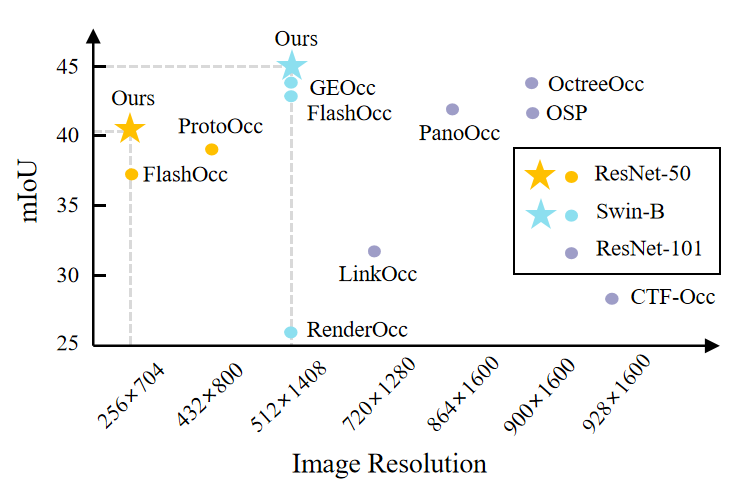
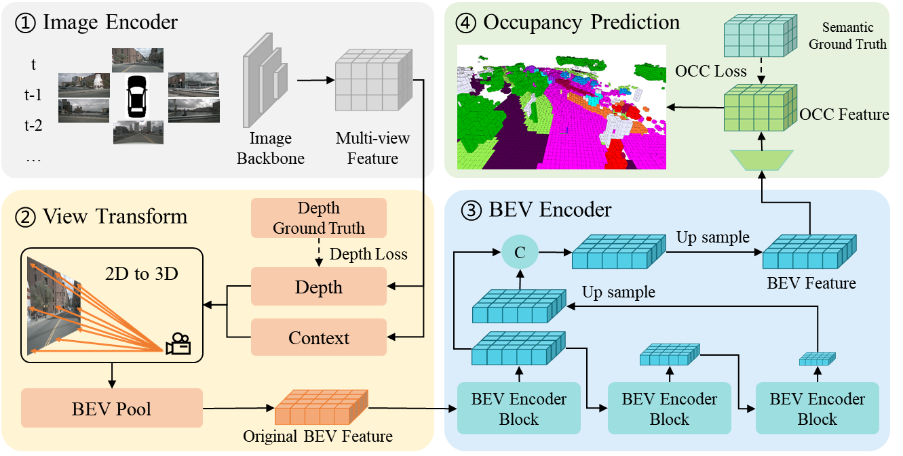
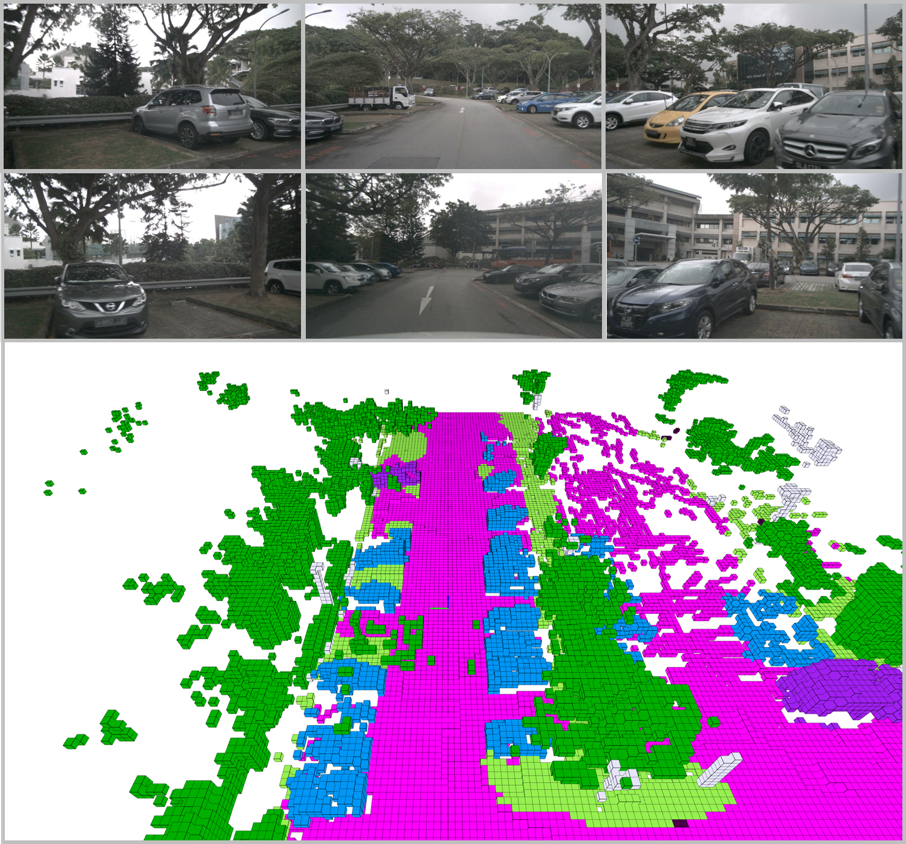

# Multi-Scale Spatial-Channel Attention Fusion Network for 3D Occupancy Prediction


<div align="left">
  
</div><br/>
The performance of SCOcc comparison with other state-of-the-art methods.


<!-- ## Introduction -->
This repository is an official implementation of SCOcc.

<div align="left">
  
</div><br/>

## TODO Lists
* Release the visualization code.
* Release the weight of SCOcc.

## Main Results
| Config                                                                                               | Backbone | Input <br/>Size | mIoU  |  Model  |      Log |
|:-----------------------------------------------------------------------------------------------------|:--------:|:----------:|:-----:|:------:|:-------:|
| [**SCOcc (1f)**](projects/configs/scocc/scocc-r50.py)                                                |   R50    |  256x704   | 33.95 |     -      |       -      |
| [**SCOcc-4D-Stereo (2f)**](projects/configs/scocc/scocc-r50-4d-stereo.py)                            |   R50    |  256x704   | 38.91 |     -    | -       |
| [**SCOcc-4D-Stereo (2f)**](projects/configs/scocc/scocc-stbase-4d-stereo-512x1408_4x4_2e-4.py) |  Swin-B  | 512x1408   | 43.76 |     -      |       -       |


## Get Started
1. [Environment Setup](doc/install.md)
2. [Model Training](doc/model_training.md)
3. [Visualization](doc/visualization.md)
<div>
  
</div><br/>

<div style="display: flex; gap: 10px;">
  <div>
     
  </div>

  <div>
    
  </div>
</div>


## Acknowledgement
Many thanks to the following open-source projects:
* [mmdetection3d](https://github.com/open-mmlab/mmdetection3d)
* [BEVDet](https://github.com/HuangJunJie2017/BEVDet)
* [RenderOcc](https://github.com/pmj110119/RenderOcc.git)
* [PanoOcc](https://github.com/Robertwyq/PanoOcc.git)
* [FlashOCC](https://github.com/Yzichen/FlashOCC.git)

[//]: # (## Bibtex)

[//]: # (If this work is helpful for your research, please consider citing the following BibTeX entry.)

[//]: # ()
[//]: # (```)

[//]: # ()
[//]: # (```)
